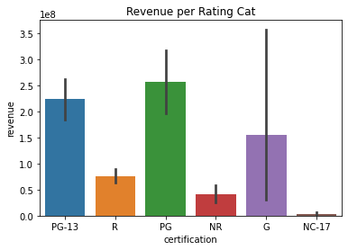

# IMDB Database Hypothesis testing
## Throughout this project I will extract, transform, and load data into MySQL database to answer business questions with the certainty of hypothesis testing.

**Author**: Cheyenne Quann

### Business problem:

what makes a movie successful?

### Data:
IMDB and The Movie Database (TMDB) data containing features like title, revenue, rating, budget, and many more. The data was extracted in csv or json files through API calls.

## Methods
- Extract and filter raw data from IMDB and TMDB
- Visualize the data to explore and find underlying trends
using seaborn and matplotlib
- Delve into data, formulating hypotheses and using AB testing to answer questions posed about the data

## Results
There has proven to be a significant impact on the revenue films bring in based on their budget, runtime and rating 
### Here are examples of how to embed images from your sub-folder

#### Visual 1 

> This plot shows a distinct difference between the revenue based on rating 

#### Visual 2 

> This plot shows a distinct difference between the revenue based on budget 

#### Visual 3 

> This plot shows a distinct difference between the revenue based on runtime 

## Recommendations:
If one would like to create blockbuster films I would suggest sticking to two hour plus runtimes children's films and if possible apply a large budget

## Limitations & Next Steps

My main limitation is this project was that I had to filter a lot of data and some of my samples were smaller than I would have preferred

### For further information

For any additional questions, please contact **Cheyenne.quann@gmail.com**
 
